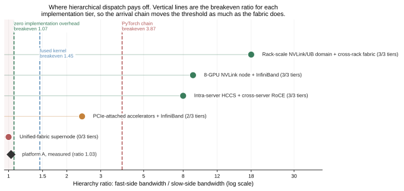
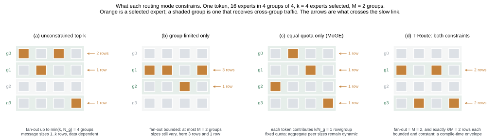
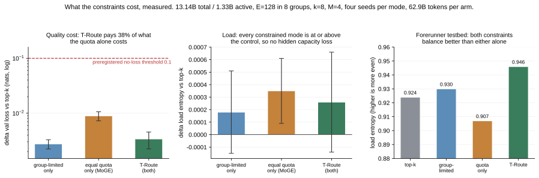
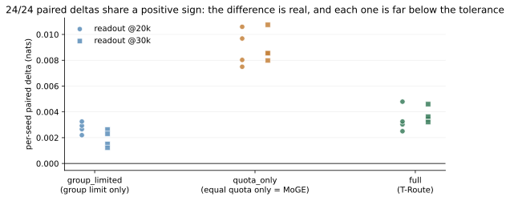
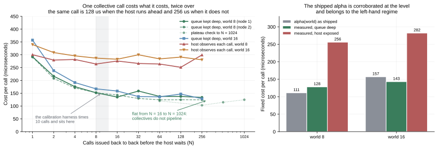
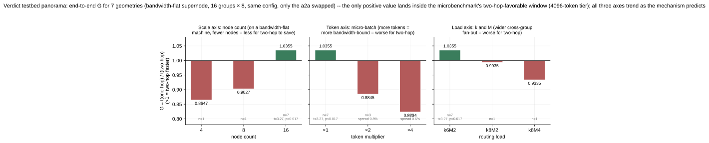

# TerraceMoE Simulator: a measurement-calibrated cost model for MoE communication, and the map of where hierarchical methods pay off

**What this is: a way to answer "should my cluster do hierarchical MoE communication?" without building it first.** A cost model for MoE all-to-all, calibrated on measured primitives, validated against independent measurement families on two machines, and pointed at the platform classes people actually run on. Plus the two methods it prices, **T-Route** (hierarchy-aligned routing constraints) and **T-A2A** (two-hop hierarchical all-to-all), with reference implementations.



Run `python -m sim.platforms` for the map. Its short form:

| Platform class | fast/slow ratio | worth two-hop? |
|---|---|---|
| Unified-fabric supernode | ~1 | no, at any implementation quality |
| PCIe accelerators + InfiniBand | ~2.4 | only with a fused arrival chain |
| Intra-server HCCS + cross-server RoCE | ~8 | yes |
| 8-GPU NVLink node + InfiniBand | ~9 | yes |
| Rack-scale NVLink/UB domain + cross-rack | ~18 | yes, and check whether EP fits inside the domain instead |

(Ratios are nominal, for orientation. Measure your own, because effective ratios differ from nominal often enough to flip a row.)

**Is *your* machine one of them?** `python -m sim.profile` runs the checklist the map is built from. A ratio alone does not decide it; six conditions do, and the tool names which one fails:

| Condition | Why it can sink an otherwise good machine |
|---|---|
| q = k/M ≥ 2 | at q=1 each token already sends one row per group, so there is nothing to deduplicate |
| ratio ≥ **effective** breakeven | the byte account needs 1.31 at R=8, q=3; your arrival chain sets the real threshold (3.87 as a PyTorch op chain, 1.45 fused) |
| EP spans >1 fast domain | if every expert fits inside one NVLink/HCCS domain there is no slow hop to save, so keep EP in the domain instead. Rack-scale domains make this common |
| messages bandwidth-bound | below the half-performance size, byte savings do not convert into time |
| α(N_g)+α(R) < α(EP) | two hops pay two fixed costs, so on a machine where α barely grows with world size the swap loses before any byte moves. **A machine property, must be measured** |
| arrival chain cost | advisory: already priced above, but it is the one item fully under your control, and fusing it moves the threshold further than most topology changes |

The checklist and the cost model can never disagree: a machine it clears is one the model scores above 1, and a test pins that.

**T-Route is the result that stands on its own.** The constraint that makes the two-hop shape expressible, bounding each token's cross-group fan-out at compile time and making every cross-group message constant-size, was measured to cost nothing: **quality-neutral** (+0.0034 nats, 3.4% of the preregistered threshold, 24/24 paired seed deltas sharing the sign), **downstream-equivalent** under preregistered TOST on two benchmarks, **load-neutral**, and **step-time-neutral** (G = 0.9976). A compile-time traffic envelope for free. What the constraint is and what the four routing modes each cost: [docs/10](docs/10-troute.md); the full ablation record: [docs/06](docs/06-troute-results.md).

> **On calibration coverage, stated plainly.** Both machines we have measured sit at hierarchy ratio near 1, unified-fabric supernodes, the leftmost row of the table. They are what calibrated the model and what proved it transfers (all constants re-fitted on the second machine, 44 independent targets at 9.3% median, no bias; and a further 14 targets collected months after the freeze, at a world never scored before, at 8.0%). They are *not* evidence about hierarchical machines. Everything to the right of that first row is extrapolation from the model, consistent in direction with public results on hierarchical fabrics (DeepSeek-V3 node-limited routing, TeleChat3-MoE +15% at EP=16, Pangu Ultra MoE) but not measured by us. Calibrating one machine above ratio 1.5 would change that; more machines at ratio 1 would not.

---

## Methods

**T-Route** adds two constraints on top of standard top-k routing:

1. **Group-limited**: each token's experts land in only M groups (group boundaries = communication hierarchy boundaries, M < N_g);
2. **Equal quota within groups**: exactly k/M experts in each selected group.

The first caps each token's cross-group fan-out at M; the second makes every cross-group message a constant size. Both are **architectural properties, independent of the data**, so traffic has a compile-time envelope. Relation to existing work: DeepSeek-V3's node-limited routing has only the group limit; MoGE's equal quota is equivalent to M = N_g. T-Route is the conjunction of the two, with M < N_g.

**T-A2A** replaces the one-hop all-to-all in dispatch with two hops: across groups, send only 1 copy to a representative card of the target group (Hop A, deduplicated); within the group, scatter to the actual expert cards (Hop B). Per-token payload over the slow links drops from q = k/M rows to 1 row, at the cost of moving an extra q(1−1/R) rows on the fast side. **This trade pays only when the slow links are significantly more expensive**, which is exactly the applicability criterion.

## Applicability criterion (run this first)

```
python tools/breakeven.py --ratio <your measured fast-side/slow-side bandwidth ratio>
```

Necessary and sufficient condition for two-hop to come out ahead on bytes (R cards per group, q experts per group; **card = die = one EP rank**, since the design docs say "card" and the measurement docs say "die" where the physical unit matters):

$$r_{be} = \frac{(1-1/R)\,q}{q-1} \quad<\quad \frac{\beta_{fast}}{\beta_{slow}}$$

At R=8: q=2 → 1.75, q=3 → 1.31, q=6 → 1.05, q=8 → 1.00.

| Fabric | Fast/slow bandwidth ratio (order of magnitude) | Verdict |
|---|---|---|
| Intra-NVLink-domain vs cross-node IB/RoCE | ~3–18× | **Pass**. Public positive evidence for the same family of methods (DeepSeek-V3's node-limited routing + IB→NVLink two-hop forwarding; TeleChat3-MoE's hierarchical A2A reports +15% training throughput at EP=16; Pangu Ultra MoE, same family) |
| Intra-server HCCS vs cross-server RoCE | ~8× | **Pass**, as above |
| **Inside a bandwidth-flat supernode** (unified switching, cross-node ≈ intra-node) | **~1.0** | **Fail. Our measurements: same config, end-to-end, two-hop is 12–22% slower at large micro-batches and ties at small ones. Do not use it.** |

Two things you must watch:

- **Use measured ratios, not nominal ones.** Effective collective-communication bandwidth is often off from nominal by more than 2x, and you must measure at **your real message sizes**, because bandwidth's dependence on message size and alignment can manufacture an entirely false conclusion. We stepped on this.
- **Bytes are only half the ledger.** Two-hop pays the fixed overhead of one extra collective; passing the criterion means "worth an experiment", not "guaranteed faster". Full checklist in [docs/03-applicability.md](docs/03-applicability.md).

## T-Route's quality cost (independent of communication; stands on its own)



T-Route is the conjunction of two constraints that exist separately in the literature: a **group limit** (a token's experts confined to M of the N_g groups, as in DeepSeek-V2 device-limited and V3 node-limited routing) and an **equal quota** inside each chosen group (as in MoGE, where M = N_g). Neither alone gives a compile-time traffic envelope: the group limit bounds fan-out but leaves message sizes data dependent, the quota fixes sizes but sends to every group. Together, and only together, both the count and the size of cross-group messages are known before the first token is routed.




The **complete ablation results, per-seed figures, and retraction records** for all four axes (quality / downstream / load / step time) are in [docs/06-troute-results.md](docs/06-troute-results.md). Headline table (13.14B total params / 1.33B active, 4 modes × 4 seeds, 62.9B tokens per arm, holdout val loss):

| Mode | Constraint | Δ vs unconstrained top-k | 90% CI |
|---|---|---|---|
| `group_limited` | group limit only (4 of 8) | +0.00276 | [+0.00223, +0.00329] |
| `quota_only` | equal quota only (= MoGE) | +0.00895 | [+0.00726, +0.01064] |
| **`full` (T-Route)** | group limit + equal quota | **+0.00339** | [+0.00224, +0.00455] |

- The cost is +0.0034 nats, **3.4%** of the preregistered no-loss threshold of 0.1 nats, and all 24 paired seed deltas (3 modes x 4 seeds x 2 readpoints) share the sign. This is not "no detectable difference": all three modes have confidence intervals excluding 0, so the effect is resolved first and only then shown to be small.



- **`full` costs about 38% of `quota_only` (roughly 62% lower)**: the group limit gives the quota a pressure-relief valve ("which M groups" remains free).
- Downstream (HellaSwag / LAMBADA, ±1.0 pp preregistered TOST): equivalent.
- Load: expert-level load entropy in the constrained modes is no lower than the control, which rules out "hidden capacity loss traded for efficiency".

**Boundary**: cross-group balance is a statistical property, not an architectural guarantee (group-level CV can reach 1.0 under adversarial input); validated up to the scale above, so do not extrapolate linearly to larger widths or more extreme M/N_g.

## Results at a glance

### The cost model, and what validates it


A collective call costs `alpha(world) + wire_bytes / beta_eff(per-peer bytes)`, with
`beta_eff = beta_inf * x / (x + x_half)`. Every constant is measured, and the model
answers to three gates rather than to a plot that looks right.

| Gate | What it checks | Result |
|---|---|---|
| Tier-1 | one-hop and two-hop times measured directly on the calibrated machine | **pass**, 2.8% median error, 24.5% worst |
| Tier-1b | 64 targets from an independent benchmark family on two machines, all constants re-fitted for the second; 14 of them collected months after the constants were frozen, at a world the calibrated machine had never been scored at | **pass** on all three corpora, 1.9% / 9.3% / 8.0% median, no bias |
| Tier-1b drift probe | a fourth corpus, 13 world-8 targets on the calibrated machine | **fail**, 15.1% median with a −9.1% bias, traced to one constant and left unretuned |
| Tier-2 | end-to-end step time on 7 training geometries | **fail, and step-level extrapolation stays locked** |

The band above is 400 Monte Carlo draws over the calibration uncertainty, including
the bootstrap interval of `x_half`. Two anchors read off it: at a hierarchy ratio of
8 the least favourable case is still 1.44, so the direction is robust; on a flat
fabric the most favourable case reaches 1.04, which says the byte account alone is
near neutral there and what actually decides is implementation overhead.

### What one collective call actually costs



`alpha(world)` is the fixed cost of a call, and a call-count scan measured it
directly rather than reading it off a fit: N collectives issued back to back at
fixed world, N from 1 to 1024, payloads from 256 B to 16 MB, two worlds, two nodes.
Three results, all of them load-bearing elsewhere in this repository.

- **Collectives do not pipeline.** Per-call cost stops falling at N around 16 and
  stays flat to N = 1024. Two back-to-back calls cost twice one, which is the
  assumption `sim/core.py` makes when it prices the two-hop chain serially.
- **The shipped `alpha` is corroborated at the level**: 129 microseconds measured
  against a tabulated 111 at world 8, 134 against 157 at world 16, both inside the
  20% run-to-run drift the calibration documents, from a different benchmark months
  later. The 41% step between the two table entries is *not* confirmed; the scan
  sees 12%, inside its own spread.
- **The same call costs twice as much when the host has to watch it.** 128
  microseconds with the queue deep, 256 when the host observes each call before
  issuing the next. The gap is a per-call cost that holds its share, 46 to 59%,
  across every payload from 64 KiB to 16 MB.

Charging two-hop one extra host exposure moves the breakeven ratio from 3.87 to
4.04. Removing the arrival chain instead moves it from 3.87 to 1.07. The ordering is
the point: fuse the chain first, and the launch path is the next thing worth paying
for, not the first.

### Where the wins and losses come from


Green is where two-hop wins. The two panels differ only in the arrival chain, and
that single implementation choice moves the breakeven ratio from 3.87 to 1.45. On a
machine at ratio 3.2, a fused arrival chain is the difference between a 1.55x win and
a 0.88x loss.

### End-to-end measurements on the calibrated machine



Seven geometries, same configuration, only the all-to-all implementation swapped.
This machine has a hierarchy ratio of 1.03, so the cost model predicts two-hop loses,
and it does. What makes the measurement useful is that all three axes move the way
the mechanism says they should: more tokens per micro-batch makes it worse because
the workload becomes bandwidth-bound, fewer nodes makes it worse because Hop A has
fewer peers to deduplicate across, and wider cross-group fan-out makes it worse
because two-hop converges to one-hop's traffic while keeping its extra costs.

### Scale, and where the data runs out


Through 128 ranks every defensible treatment of `alpha` agrees to the digit. Past
that, the only corpus covering worlds 256 and 512 sits five times below every other
in absolute bandwidth and fits worst by a factor of four, so the figure plots the
band across four treatments instead of a line. At 512 ranks they span 1.37 to 2.94
and the direction of the trend flips, which is why this repository makes no claim
about clusters past 128 ranks.

## Repository layout

| Path | Contents | Status |
|---|---|---|
| `terrace/routing.py` | T-Route reference implementation; all four ablation modes switch inside one function | **Validated** (quality ablation + property tests) |
| `terrace/ta2a*.py` | T-A2A two-hop chain: planning, dispatch, packing, differentiable seam | **Validated bit-exact** (guarded by the repo's 291 CPU tests; end-to-end measured only on a flat supernode, see the criterion) |
| `terrace/ops/` | Arrival-chain fused kernels (AscendC): passthrough / K1 / K2 + executable CPU spec | passthrough passes bit-exact validation on device; **K1 algorithm proven correct, but the device-side translation has one unfixed multi-core scalar-write visibility bug (the earlier out-of-bounds is fixed); K2 not validated on hardware** (see [docs/04-kernel-status.md](docs/04-kernel-status.md)) |
| `sim/` | Measurement-calibrated cost model: cluster spec → one-hop/two-hop times, breakeven maps, Monte Carlo uncertainty bands, expert-FFN roofline, platform registry and the worth-it checklist (see [docs/05-simulator.md](docs/05-simulator.md)) | **Tier-1 and Tier-1b validation gates passed** (2.8% median against the calibration's own benchmark; 1.9%/9.3%/8.0% against an independent benchmark family on two machines, the last corpus collected after the freeze; a fourth world-8 corpus fails and the cause is recorded rather than tuned away); Tier-2 (end-to-end step level) honestly marked as failing, step-level extrapolation banned. The systematic negative result across six families of overlap models, and the measurement protocol that would break the impasse, are in [docs/07-tier2-overlap.md](docs/07-tier2-overlap.md) |
| `tools/breakeven.py` | Applicability criterion (closed form; together with sim/, two independent implementations of the same ledger, cross-checked by tests) | — |
| `tests/` | 291 tests, pure CPU (no NPU needed) | All green |
| `tools/onesided/` | One-sided transfer instrument: preregistered benchmark of aclshmem put vs collective a2a, plus hyper-parallel patches (free serialization + UAF, hard-coded block_dim) and EQ usage traps | Ruled a loss on the bandwidth-flat machine (best case 0.68× a2a, see [docs/08-onesided.md](docs/08-onesided.md)); the patches apply to every Ascend+shmem user |
| `docs/` | Design docs ×5, the routing constraint explained (docs/10), full ablation results (docs/06), the Tier-2 campaign (docs/07), the one-sided verdict (docs/08), and the phase model with the measurement that would calibrate it (docs/09); figures-first | — |
| `tools/gen_figures.py` | Result-figure generation (numbers embedded; figures reproducible) | — |

**Not in this repository**: training-framework integration (upstream training stack / Megatron shims), cluster and measurement scripts, raw experiment data, internal records. The seam contract is in [docs/02-ta2a-design.md](docs/02-ta2a-design.md); integrators write their own shims against the contract.

## Running the tests

```
python -m pytest tests/ -q        # torch only, runs on CPU, about 70 seconds
python -m sim.validate_micro      # simulator Tier-1 validation gate
python -m sim.sweep               # cross-cluster extrapolation (gate checked at entry; all output labeled "simulated")
```

## License

Apache-2.0
