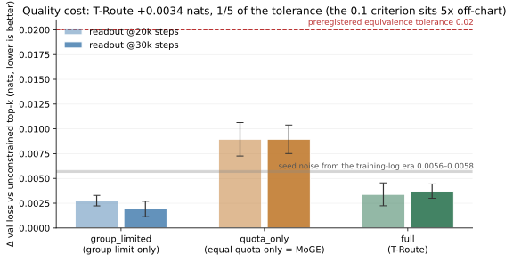

# TerraceMoE Simulator: MoE communication methods for hierarchical clusters, with measurement-calibrated simulation

Three things: the methods and reference implementations of **T-Route** (hierarchy-aligned routing constraints) and **T-A2A** (two-hop hierarchical all-to-all); an **applicability criterion** (should your cluster use this at all); and a communication simulator (`sim/`) that is **calibrated on real measurements and validated against independent measurements** — calibrate on one machine, answer questions about clusters of many.

> **One-sentence positioning: these methods target clusters with pronounced hierarchy** — fabrics where the fast side (intra-node / intra-rack / intra-supernode) has at least 1.5x the bandwidth of the slow side (cross-node / cross-rack), under the q≥3 convention. We built the whole thing on a **bandwidth-flat** supernode and measured it to the bottom: **on a flat fabric, two-hop does not pay** (see [Applicability criterion](#applicability-criterion-run-this-first)). We open-source it because the criterion, the derivation, and the implementation still hold for hierarchical clusters — the same family of methods has been validated as effective on hierarchical fabrics by multiple public works.

---

## Methods

**T-Route** adds two constraints on top of standard top-k routing:

1. **Group-limited** — each token's experts land in only M groups (group boundaries = communication hierarchy boundaries, M < N_g);
2. **Equal quota within groups** — exactly k/M experts in each selected group.

The first caps each token's cross-group fan-out at M; the second makes every cross-group message a constant size. Both are **architectural properties, independent of the data** — traffic has a compile-time envelope. Relation to existing work: DeepSeek-V3's node-limited routing has only the group limit; MoGE's equal quota is equivalent to M = N_g. T-Route is the conjunction of the two, with M < N_g.

**T-A2A** replaces the one-hop all-to-all in dispatch with two hops: across groups, send only 1 copy to a representative card of the target group (Hop A, deduplicated); within the group, scatter to the actual expert cards (Hop B). Per-token payload over the slow links drops from q = k/M rows to 1 row, at the cost of moving an extra q(1−1/R) rows on the fast side. **This trade pays only when the slow links are significantly more expensive** — which is exactly the applicability criterion.

## Applicability criterion (run this first)

```
python tools/breakeven.py --ratio <your measured fast-side/slow-side bandwidth ratio>
```

Necessary and sufficient condition for two-hop to come out ahead on bytes (R cards per group, q experts per group; **card = die = one EP rank** — the design docs say "card", the measurement docs say "die" where the physical unit matters):

$$r_{be} = \frac{(1-1/R)\,q}{q-1} \quad<\quad \frac{\beta_{fast}}{\beta_{slow}}$$

At R=8: q=2 → 1.75, q=3 → 1.31, q=6 → 1.05, q=8 → 1.00.

| Fabric | Fast/slow bandwidth ratio (order of magnitude) | Verdict |
|---|---|---|
| Intra-NVLink-domain vs cross-node IB/RoCE | ~3–18× | **Pass**. Public positive evidence for the same family of methods (DeepSeek-V3's node-limited routing + IB→NVLink two-hop forwarding; TeleChat3-MoE's hierarchical A2A reports +15% training throughput at EP=16; Pangu Ultra MoE, same family) |
| Intra-server HCCS vs cross-server RoCE | ~8× | **Pass**, as above |
| **Inside a bandwidth-flat supernode** (unified switching, cross-node ≈ intra-node) | **~1.0** | **Fail. Our measurements: same config, end-to-end, two-hop is 12–22% slower at large micro-batches and ties at small ones. Do not use it.** |

Two things you must watch:

- **Use measured ratios, not nominal ones.** Effective collective-communication bandwidth is often off from nominal by more than 2x, and you must measure at **your real message sizes** — bandwidth's dependence on message size/alignment can manufacture an entirely false conclusion (we stepped on this).
- **Bytes are only half the ledger.** Two-hop pays the fixed overhead of one extra collective; passing the criterion means "worth an experiment", not "guaranteed faster". Full checklist in [docs/03-applicability.md](docs/03-applicability.md).

## T-Route's quality cost (independent of communication; stands on its own)



The **complete ablation results, per-seed figures, and retraction records** for all four axes (quality / downstream / load / step time) are in [docs/06-troute-results.md](docs/06-troute-results.md). Headline table (13.14B total params / 1.33B active, 4 modes × 4 seeds, 62.9B tokens per arm, holdout val loss):

| Mode | Constraint | Δ vs unconstrained top-k | 90% CI |
|---|---|---|---|
| `group_limited` | group limit only (4 of 8) | +0.00276 | [+0.00223, +0.00329] |
| `quota_only` | equal quota only (= MoGE) | +0.00895 | [+0.00726, +0.01064] |
| **`full` (T-Route)** | group limit + equal quota | **+0.00339** | [+0.00224, +0.00455] |

- The cost is +0.0034 nats — **3.4%** of the preregistered no-loss threshold of 0.1 nats; 12/12 per-seed deltas share the sign. This is not "no detectable difference" — all three modes' CIs exclude 0; the effect is resolved first, then confirmed small.
- **`full` costs about 38% of `quota_only` (roughly 62% lower)**: the group limit gives the quota a pressure-relief valve ("which M groups" remains free).
- Downstream (HellaSwag / LAMBADA, ±1.0 pp preregistered TOST): equivalent.
- Load: expert-level load entropy in the constrained modes is no lower than the control — "hidden capacity loss traded for efficiency" is ruled out.

**Boundary**: cross-group balance is a statistical property, not an architectural guarantee (group-level CV can reach 1.0 under adversarial input); validated up to the scale above — do not extrapolate linearly to larger widths or more extreme M/N_g.

## Repository layout

| Path | Contents | Status |
|---|---|---|
| `terrace/routing.py` | T-Route reference implementation; all four ablation modes switch inside one function | **Validated** (quality ablation + property tests) |
| `terrace/ta2a*.py` | T-A2A two-hop chain: planning, dispatch, packing, differentiable seam | **Validated bit-exact** (guarded by the repo's 285 CPU tests; end-to-end measured only on a flat supernode — see the criterion) |
| `terrace/ops/` | Arrival-chain fused kernels (AscendC): passthrough / K1 / K2 + executable CPU spec | passthrough passes bit-exact validation on device; **K1 algorithm proven correct, but the device-side translation has one unfixed multi-core scalar-write visibility bug (the earlier out-of-bounds is fixed); K2 not validated on hardware** (see [docs/04-kernel-status.md](docs/04-kernel-status.md)) |
| `sim/` | Measurement-calibrated communication simulator: cluster spec → one-hop/two-hop times, breakeven maps, Monte Carlo uncertainty bands, expert-FFN roofline (see [docs/05-simulator.md](docs/05-simulator.md)) | **Tier-1 and Tier-1b validation gates passed** (2.8% median against the calibration's own benchmark; 1.9%/9.3% against an independent benchmark family on two machines); Tier-2 (end-to-end step level) honestly marked as failing, step-level extrapolation banned — the systematic negative result across six families of overlap models, and the measurement protocol that would break the impasse, are in [docs/07-tier2-overlap.md](docs/07-tier2-overlap.md) |
| `tools/breakeven.py` | Applicability criterion (closed form; together with sim/, two independent implementations of the same ledger, cross-checked by tests) | — |
| `tests/` | 285 tests, pure CPU (no NPU needed) | All green |
| `tools/onesided/` | One-sided transfer instrument: preregistered benchmark of aclshmem put vs collective a2a, plus hyper-parallel patches (free serialization + UAF, hard-coded block_dim) and EQ usage traps | Ruled a loss on the bandwidth-flat machine (best case 0.68× a2a, see [docs/08-onesided.md](docs/08-onesided.md)); the patches apply to every Ascend+shmem user |
| `docs/` | Design docs ×5 + the full ablation results (docs/06) + the Tier-2 campaign (docs/07) + the one-sided negative verdict (docs/08); figures-first | — |
| `tools/gen_figures.py` | Result-figure generation (numbers embedded; figures reproducible) | — |

**Not in this repository**: training-framework integration (upstream training stack / Megatron shims), cluster and measurement scripts, raw experiment data, internal records. The seam contract is in [docs/02-ta2a-design.md](docs/02-ta2a-design.md); integrators write their own shims against the contract.

## Running the tests

```
python -m pytest tests/ -q        # torch only, runs on CPU, about 70 seconds
python -m sim.validate_micro      # simulator Tier-1 validation gate
python -m sim.sweep               # cross-cluster extrapolation (gate checked at entry; all output labeled "simulated")
```

## Honesty statement

This is not a repository shipped with victory numbers. We built these methods out in full on a **flat** supernode and measured them to the bottom; the conclusion is **do not use them on that class of machine**. We open-source the methods, the criterion, and the complete derivation of "why it does not pay" so that users of hierarchical clusters do not have to walk this road again — **compute the criterion first, then decide whether to integrate**. Every number here either comes with its derivation or is labeled with how it was measured; anything tied to specific machines or internal paths has been removed.

## License

Apache-2.0
