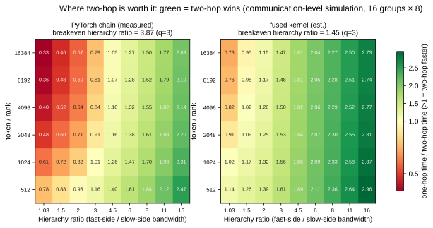
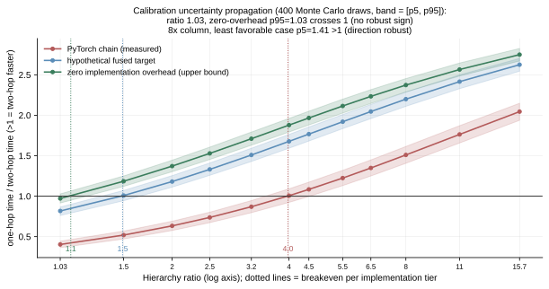
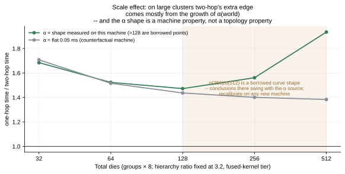

# The simulator: measured on one machine, answers for many clusters

`sim/` is a **measurement-calibrated** MoE-EP communication simulator: given a cluster spec
(α, β, and group size for the fast/slow tiers) and a MoE geometry (E/N_g/k/M/H/sequence/
micro-batch), it predicts one-hop and two-hop all-to-all communication time, and — only where
the validation gates pass — extrapolates the comparison to clusters you do not have.

## Methodology (this is the main deliverable; the code is just its carrier)

```
measure  ->  calibrate  ->  validate  ->  extrapolate
```

1. **Measure**: microbenchmarks measure primitives only — the α(world) curve, β (aligned-payload
   convention), and per-call fixed costs (splits host sync, arrival chain).
2. **Calibrate**: every simulator parameter points to one measurement, with its convention noted
   (`sim/calibrate.py`); this repo publishes the distilled constants, not the raw sweeps.
3. **Validate (the step most simulation work skips)**: the simulator must first reproduce
   **independent measurements on the same machine** before it earns the right to extrapolate.
   Two gate tiers, thresholds fixed ahead of the targets:
   - **Tier-1 (communication micro level)**: against directly measured one-hop/two-hop times on
     the same machine — median relative error ≤20%, max ≤35%, crossover position reproduced.
     **Current: pass** (8.1% / 12.5% / 2048–4096).
   - **Tier-2 (end-to-end step level)**: against measured G on 7 training geometries
     (1 calibration, 6 holdout; n4 is a scale-axis point added after preregistration).
     **Current: fail — step-level extrapolation stays locked.** The cause, named: the sum of
     phase-level timings differs from the step-level delta by ~5× (the two arms overlap
     differently across the dual streams; event-timed phase spans do not add up to step time).
     This is a known open problem, not something parameter tuning can fix; the test suite pins
     `test_tier2_step_gate_currently_fails_documented` — **the day this gate suddenly turns
     green, a human must check whether the problem was actually solved or the gate was loosened**.
4. **Extrapolate**: only tiers that passed their gate may extrapolate, and every output is
   labeled "simulated".

## Calibration highlights (details in the `sim/calibrate.py` comments)

- **β_fast has physical backing**: intra-node 8-die a2a measures 122.6 GB/s, within 0.2% of the
  aggregate-egress physical value (6 × intra-node link 112.1 + 1 × in-package direct 185)/7
  = 122.4, and run-to-run spread at this tier is <0.3% — the most stable number in the entire
  dataset.
- **α is a machine property; never assume it across machines**: on this machine, directly
  measured α(16)+α(8) ≈ α(128) (two-hop saves almost nothing on α); another machine's curve
  implies a 2.85× saving. Across machines you may borrow only the shape — re-calibrate locally,
  and report sensitivity.
- **Machine run-to-run drift is ~20%**: validation targets use the pooled median across runs;
  no single-run number is good enough to serve as a gate.

## The first extrapolation figure (communication level, Tier-1 unlocked; all numbers are **simulated**, not measured)

One-hop time / two-hop time (>1 = two-hop faster), 16 groups × R=8, k=6, T=4096 tokens/rank:

| Implementation tier \ hierarchy ratio | 1.03 (flat) | 3.2 | 8 | 15.7 |
|---|---|---|---|---|
| PyTorch arrival chain (measured 0.0875 µs/row) | 0.39 | 0.83 | 1.47 | 2.02 |
| Fused kernel (est. 0.012) | 0.79 | 1.47 | 2.18 | 2.63 |
| Zero implementation overhead (upper bound) | 0.94 | 1.68 | 2.36 | 2.77 |

(q=3; for q=2/q=6 and all six hierarchy-ratio tiers, run `python -m sim.sweep` to compute them
live — the table tracks the calibration; the doc stores only a snapshot.)

Three consistency anchors:

- The flat column is ≤1 — reproducing our measured negative verdict on the flat supernode
  (internal consistency);
- Columns at hierarchy ratio ≥3.2 are >1 — directionally consistent with public work
  (DeepSeek-V3 node-limited, TeleChat3-MoE +15%, Pangu Ultra MoE) (external consistency);
- The implementation tier's impact is on the same order as the hierarchy ratio's —
  **"fix the implementation first, then talk topology" holds on hierarchical machines too**.

## Three new figures: is two-hop worth it, at a glance (all **simulated**, Tier-1 scope)

### The breakeven map: which region does your cluster land in?



Green region = two-hop wins. **Breakeven hierarchy ratio** (the smallest hierarchy ratio at
which two-hop starts to win, q=3, T=4096):

| Implementation tier | breakeven hierarchy ratio |
|---|---|
| PyTorch arrival chain (measured 0.0875 µs/row) | **4.20** |
| Fused kernel (est. 0.012) | **1.57** |
| Zero implementation overhead (upper bound) | 1.16 |

One-sentence takeaway: **the implementation tier pulls breakeven from 4.2 down to 1.6** — on
common hierarchical machines like NVLink/IB (≈3.2), whether hierarchical communication is worth
doing depends on how well your arrival chain is written, not on the topology.

### Uncertainty bands: is the conclusion stable against calibration error?



Calibration constants are not ground truth; they are measurements with spread (measured machine
run-to-run drift ±9~20%). 400 Monte Carlo draws propagate that spread into the extrapolation
(provenance noted item by item, see `sim/uncertainty.py`; fixed seed, reruns match bit for bit).
Two robustness anchors:

- Flat column, most favorable case (zero implementation overhead): p95 = **0.99 ≤ 1** — our
  negative verdict on the flat machine is robust to calibration error; but the margin is only
  0.01, so the claim stops at this precision and gets no further embellishment;
- 8× column, least favorable case (PyTorch chain): p5 = **1.37 > 1** — on hierarchical machines,
  the direction "two-hop wins" is robust to calibration error.

### Scale effects: where does the large-cluster advantage come from?



Fix hierarchy ratio 3.2 and the fused tier, and scale the cluster up. Through **128 dies** the
answer is solid: 1.68 → 1.52 → 1.47 at 32 / 64 / 128, and those three numbers are *identical to
the digit* under every defensible treatment of α, because they use only the worlds we measured
directly (8, 16, 128).

**Past 128 dies this repository makes no claim.** An audit of every size sweep we own (331
usable a2a points, four datasets, two machines) found that the single corpus covering worlds
256 and 512 is also the corpus whose absolute bandwidth sits ~5× below all the others and which
the cost model fits worst — 40% median relative error, against 5–11% everywhere else. Push four
defensible treatments of those two α entries through the extrapolation and the 512-die ratio
lands anywhere in **1.37 – 2.94**, with the *direction of the trend flipping* between them
(under "no growth past 128" the ratio falls from 1.47 to 1.37). The figure plots that band
rather than a line, and `tests/test_sim.py` pins both halves: insensitivity below 128, and a
≥2× spread at 512 so the claim cannot be quietly re-hardened.

What survives is the mechanism, not the magnitude: two-hop's large-cluster upside is bought
with α(world) — one-hop pays α at the full world while two-hop pays α at two much smaller
worlds — and **α's shape is a machine property**, so on any new machine this question reopens
and must be re-measured, not inherited.

Geometry sensitivity (a 54-point (group count, R, k, M) grid, `sim.uncertainty.geometry_grid`)
is consistent with that mechanism, and carries the same caveat wherever it reaches past 128.
Ranking the three axes by how far they actually move breakeven (fused tier): **implementation
tier largest** (4.20 → 1.16, Δ≈3.0) > scale axis (Δ≤1.9, and only the ≤128 part of it is
trustworthy) > geometry axis ((k,M) moves ±0.2~0.3 at fixed world; under the PyTorch tier the
geometry axis widens to ±1.2, but the ordering stands).

## Calibration audit: what 331 measured points say about the constants

The shipped constants were distilled from one benchmark family. Re-fitting the
parametric cost model against **every size sweep we own** — 331 usable a2a points
across four datasets and two machines (`sim/fit.py`) — puts each constant on a
different footing:

| Constant | Verdict | Evidence |
|---|---|---|
| β (asymptotic bandwidth) | **corroborated** | fitted independently per dataset: 117.8 / 111.0 / 113.4 / 130.3 GB/s — spread narrower than the machine's own drift, and unchanged whether α is pinned or free |
| α at worlds 8 / 16 / 128 | **corroborated** | direct measurements; every scale conclusion below 128 ranks is identical under all α treatments |
| α at worlds 256 / 512 | **not supported** | only one corpus reaches them, and it is the corpus with 5× lower absolute bandwidth and 40% fit error vs 5–11% elsewhere — see the scale section above |
| half-performance size `x_half` | **not identifiable** | trades off against α; moves 3–5× depending on whether α is pinned. Quote it only from a pinned-α fit |

Two attempts that the data **rejected**, kept here because a rejected alternative
is a result:

- **Replacing the flat β with the fitted saturating curve fails Tier-1** (median
  8.1% → 17.9%, worst 12.5% → 101.6%). The flat β stands.
- **A world-scaling bandwidth term** (bandwidth degrading past ~128 ranks) is
  visible in one dataset at matched per-peer size — roughly 0.55× at 256 and 0.36×
  at 512 — but that is the same low-confidence dataset, so the term is recorded as
  unconfirmed and deliberately left out of the model.

And one inconsistency we **cannot** resolve offline: two of our own benchmark
families disagree about the same machine in the same week, reporting ~0.39 ms
against 0.52–0.65 ms at comparable per-peer sizes. The calibration and the Tier-1
gate are both anchored to the first family, so the gate is internally consistent
but not cross-validated. The second family is a drift study whose own run-to-run
spread is 2.1–3.1× — wide enough to contain the disagreement without explaining
it. Anyone recalibrating should run both styles and check they agree first.

## The Tier-2 step-level synthesis campaign record

All six families of single-parameter global overlap models are dead; the negative result plus
the breakthrough measurement protocol are in
**[docs/07-tier2-overlap.md](07-tier2-overlap.md)** — step-level extrapolation stays locked,
but "which measurement is missing, how to take it, and how to verify self-consistency" is now
written up as a protocol anyone with a cluster can run as-is.

## Bring your own machine

1. Measure three things with the same conventions as `docs/03 §4`: α (by world size), β
   (aligned-payload convention), and per-call fixed cost;
2. Fill in a `ClusterSpec` (model it on `sim/calibrate.py::flat_supernode`);
3. Replace `sim/validate_micro.py::MICRO_TARGETS` with the same-type microbenchmarks from your
   machine, and re-pass the gates;
4. Only after the gates are green, look at the `python -m sim.sweep` extrapolation.

## Run

```
python -m sim.validate_micro     # Tier-1 gate
python -m sim.validate           # Tier-2 gate (currently reports the failure, truthfully)
python -m sim.sweep              # extrapolation (checks the gates at entry)
python -m sim.overlap            # Tier-2 campaign: overlap model family battle report (docs/07)
python -m sim.uncertainty        # Monte Carlo uncertainty bands + breakeven (fixed seed)
python tools/gen_sim_figures.py  # regenerate F7-F12 (numbers computed live; only F12 embeds measurements)
python -m pytest tests/test_sim.py -q
```
