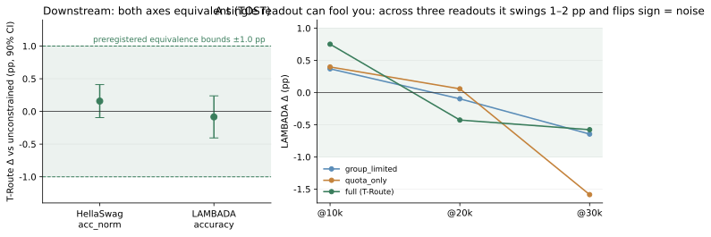
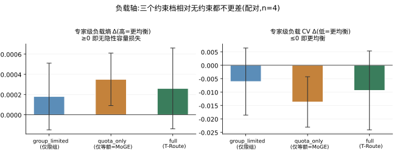
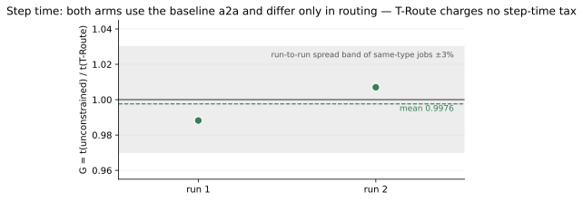
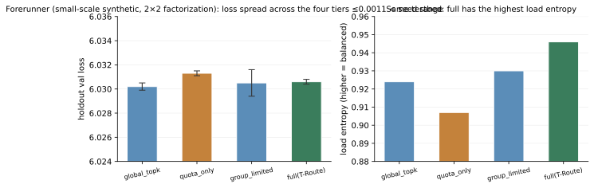

# T-Route 消融结果全集

**一句话:T-Route(限组 + 组内等额)在质量、下游、负载、步时四条轴上全部无损/中性,且每条轴都是预注册判据 + 配对种子 + 留出集/独立测量。** 图内嵌的数字与 `tools/gen_figures.py` 内嵌的一致——脚本即出处,图可复现。

试验台:13.14B 总参 / 1.33B 激活,E=128 = 8 组 × 16,k=8,M=4;4 路由模式 × 4 种子 = 16 臂,每臂 62.9B token;四模式在**同一函数**内以 `mode` 切换(同一条代码路径是消融可比的前提,实现见 `terrace/routing.py`)。

---

## 1. 质量轴:+0.0034 nats,容差的 1/5

| 档 | Δ @20k(90% CI) | Δ @30k(90% CI) | 两读点漂移 |
|---|---|---|---|
| group_limited | +0.00276 [+0.00223, +0.00329] | +0.00192 [+0.00114, +0.00270] | −0.00084 |
| quota_only(=MoGE) | +0.00895 [+0.00726, +0.01064] | +0.00895 [+0.00751, +0.01039] | **±0.00000** |
| **full(T-Route)** | **+0.00339 [+0.00224, +0.00455]** | +0.00372 [+0.00300, +0.00444] | +0.00033 |

读法三条:

- **这不是「测不出差异」,是「差异很小且测得出来」**——三档 CI 都不含 0。留出集探针的臂内 sd 0.0008–0.0023 nats,比训练日志口径的种子噪声(0.0056–0.0058)低一个量级;此前该轴报「不可分辨」是尺子不够,不是效应为零。
- **full 比 quota_only 便宜 ~62%**:限组给等额留了泄压口——quota_only 要求在全部组各放专家,full 只在被选中的 M 组内各放 q 个,"用哪 M 组"仍自由。
- 测量口径:16 臂的 checkpoint 统一重测(`--skip-train` 通道,留出片,每臂 4096 条序列、同 seed 同 GBS,32 格逐格核验读点)。

## 2. 逐种子:24/24 个配对差同号

3 约束档 × 4 种子 × 2 读点 = 24 个配对差**全部为正**——效应真实、方向一致、且每一个都远小于容差。点估计的可信度还有一个旁证:quota_only 在相隔 10k 步的两个读点上给出五位小数相同的 +0.00895。

## 3. 下游轴:两轴等价,并附一堂"单读点会骗人"的课

| 轴 | T-Route Δ | 90% CI | TOST @ ±1.0 pp(预注册) |
|---|---|---|---|
| HellaSwag acc_norm(3000 题,loglikelihood) | +0.158 pp | [−0.095, +0.411] | **等价** |
| LAMBADA accuracy(5153 题,三读点合并) | −0.084 pp | [−0.406, +0.238] | **等价** |

右图是方法学上最值钱的一块:LAMBADA 单看 @30k 一个读点,T-Route Δ=−0.577、CI 恰好压出 ±1.0——**若只测一次会误报有损**。补 @10k/@20k 后,每个模式的点估计在读点间摆动 1–2 pp 且变号,摆幅大于任何单点估计本身——这是噪声的签名。n=4 下 LAMBADA 分辨不了 1 pp 以下的效应,本仓库对该轴只作等价判定、不主张具体代价值。

## 4. 负载轴:约束没有以隐性容量损失换效率

判据问的是**相对**:约束档相对无约束有没有变差(同种子配对,n=4,各臂末 50 窗口均值)。三档的专家级负载熵差 ≥0、CV 差 ≤0——不但不差,方向还略好。路由翻转率那一半独立闭合(约束/无约束 flip 比 0.990)。

## 5. 步时轴:约束不收步时税

两臂**同用基线一跳 a2a、只差路由**(on = full,off = 无约束 top-k;两臂的模式/配额开关经三重独立复核),16 节点 × 8 卡端到端,每臂 10 个稳态步时中位:

| 发 | G = t(无约束)/t(T-Route) |
|---|---|
| 1 | 0.9882 |
| 2 | 1.0070 |
| 均值 | **0.9976**(跨 1.0 两侧,同型作业发间散布 ±1–3%) |

**T-Route 的步时效应为零(噪声内)。** 连同上面三轴:它是质量中性 + 步时中性的结构约束;它买到的是**编译期通信包络**(每 token 跨组扇出 ≤M、跨组消息定长)——这正是层级化集群上分层通信的使能件(docs/03)。注意负载熵的优势(前哨图 F6)**没有**折成步时——代理指标与交付指标要分开测,这条也是方法论的一部分。

## 6. 前哨:小规模 2×2 分解

在主消融之前,小规模合成试验台(0.5B/A0.1B,单节点,4 模式 × 2 种子)先把两条约束 2×2 分解验证:四档收敛 val loss 相互差 ≤0.0011 nats(小于种子内极差),full 的负载熵最高(0.946)。前哨的判定权重低于主消融(任务判别力弱),价值在证伪方法缺陷与交付消融设施。

## 7. 撤回与阴性记录(完整保留——它们是上面数字可信的原因)

1. **前哨第一轮作废**:曾用训练集 loss 比较,表面显示 full 大胜(6.22 vs 6.62)。核查轨迹判定无效:未收敛(比的是"谁先进入陡降段")、过拟合(31 epoch 记忆非泛化)、降段时序方差(同模式两种子差 0.79)。修正后(留出集 + 训至平台)得到第 6 节的干净结果。
2. **前哨 4b run 整体撤回**:该 run 的专家反向因后端缺陷全程不传播——路由专家冻结在初始化,四档相等是必然,不构成无损证据;连同其上的机制归因(「结构化路由记忆更多」)一并撤回。替代证据来自修复后端后的重跑(hard 任务 6 种子配对 full Δ=+0.0011)。
3. **LAMBADA 两条单读点结论撤回**(见第 3 节):n=4 下单读点估计会在 1–2 pp 内摆动并变号。
4. 判定纪律:等价边界在跑之前写死;overfit 场景以 val-minimum(early-stopping)为比较点,不用 final-val。

## 8. 边界(照抄不软化)

- 组间均衡是**统计性质不是架构保证**:M < N_g 时"用哪 M 组"由数据决定,对抗输入下组级 CV 可达 1.0(`tests/test_routing.py` 附可复现反例)。
- 已验证到上述规模与几何;不能把 3.4% 这个比例线性外推到更大宽度或更极端的 M/N_g。
- MoGE 对照(quota_only)要求 k ≥ N_g 且 N_g | k,只在本几何满足,该格不能与其他几何混列。
- 步时中性在**带宽扁平**的机器上测得;层级化机器上约束的通信收益走 docs/03 的判据,与本篇的中性结论不冲突(那里赚的是包络,不是这里的均衡)。
