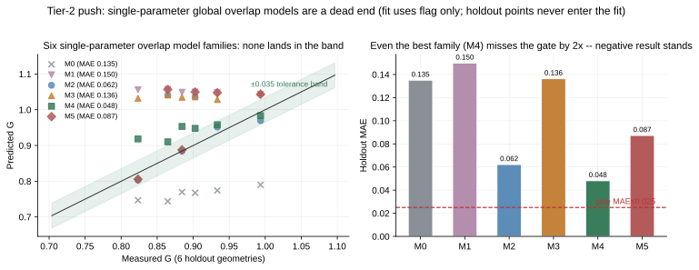

# Tier-2 攻坚:重叠感知合成模型 —— 系统化负结果与破局协议

**一句话:六个结构不同的单参数重叠模型族,统一在标定点拟合、保留点评估,
无一过门 —— 「相位账加不出步账」不是差一个系数,是缺一种测量。缺的那种
测量的协议在本篇末尾,给任何有集群的人直接照跑。**

图表数字全部由 `python -m sim.overlap` 现场产出,脚本即出处。

---

## 1. 全族战报:无一进带

| 族 | 结构(Δ = 两跳步差预测) | 参数(flag 反解) | 保留点 MAE | ±0.035 内 | 负号方向 | 门 |
|---|---|---|---|---|---|---|
| M0 | naive:Δ = Δmodel(无重叠,现行基线) | — | 0.141 | 0/6 | 5/5 | 不过 |
| M1 | 比例暴露:Δ = φ·Δmodel | φ = −0.149 | 0.149 | 0/6 | 0/5 | 不过 |
| M2 | 每调用隐藏:Δ = Δmodel − h·calls | h = 2.57 ms | 0.065 | 4/6 | 3/5 | 不过 |
| M3 | 隐藏固定成本:Δ = Δmodel − φ·fixed | φ = 1.17 | 0.140 | 0/6 | 0/5 | 不过 |
| M4 | 隐藏∝计算:Δ = Δmodel − c·T_comp | c = 0.302 | **0.048** | 2/6 | **5/5** | 不过 |
| M5 | 暴露∝流水压力:Δ = Δmodel·(1−λ/mbs) | λ = 1.149 | 0.087 | 2/6 | 2/5 | 不过 |

门 = 保留点 MAE ≤ 0.025 且 ≥4/6 进 ±0.035 且负号点方向全对 —— 阈值数字沿用 Tier-2 预注册;分母按现有 6 个保留点如实计(n4 为预注册后加入的规模轴点)。负号点 = 预注册的 4 个(tok2x/tok4x/k8m4/n8)+ n4;k8m2(G=0.9935,距 1 在 n=1 噪声内)不计方向。
拟合只用标定点 flag,六个保留点从未参与 —— 表里的失败是真失败,不是过拟合的失败。

读法两条:

- **量级最近的(M2,MAE 0.065)在规模轴上翻符号**:它预测 n8/n4 两跳赢,实测两跳
  大输(G=0.90/0.86)。每调用隐藏固定毫秒数的图景在调用数翻倍时过度隐藏。
- **方向全对的(M4,5/5)量级差门两倍**:隐藏量与计算时长成比例的图景抓住了结构,
  但一个全局系数摆不平「flag 两跳反赢 151 ms」与「n4 两跳输 1833 ms」的张力。

## 2. 为什么到此为止:自由度的账

侦察表(`python -m sim.overlap` 第一段输出)把矛盾摆到最尖:

| 几何 | mbs | 实测 G | Δ实测 (ms) | Δ模型 (ms) | 其中固定成本 | 隐含暴露比 |
|---|---|---|---|---|---|---|
| flag | 1 | 1.0355 | **−152** | +1018 | 1000 | **−0.15** |
| tok2x | 2 | 0.8845 | +437 | +1033 | 990 | +0.42 |
| tok4x | 4 | 0.8234 | +642 | +1041 | 985 | +0.62 |
| k8m2 | 1 | 0.9935 | +31 | +1330 | 1327 | +0.02 |
| k8m4 | 1 | 0.9335 | +332 | +1411 | 1327 | +0.24 |
| n8 | 1 | 0.9027 | +718 | +2083 | 2001 | +0.34 |
| n4 | 1 | 0.8647 | +1833 | +4151 | 4002 | +0.44 |

- 通信模型的步差**几乎全是「到达链 + splits 同步」的固定成本**(flag:1018 里
  1000);带宽扁平机上两臂的纯通信差接近零 —— 所以步级预测的成败全押在
  「固定成本有多少被重叠隐藏」上。
- 隐含暴露比从 −0.15 到 +0.62,**连符号都不一致**:暴露不是一个全局常数,
  是几何的函数 —— 而它随哪个几何量怎么走,七个点分不清(mbs 轴说随流水压力涨,
  规模轴说随调用数涨,flag 点说还有为负的成分)。
- **一个标定点只定得起一个参数。** 两参数族在这个切分下欠定;拿保留点参与拟合
  等于取消验证。所以单参数族串行枚举是此路的全部 —— 枚举完,全灭,负结果成立。

诚实条款:六个族在同一组保留点上串行评估,本身就是模型选择 —— 即使哪个族
回溯过了门,也不构成解锁(`tests/test_sim.py` 钉着这条)。**Tier-2 的门保持红色,
步级外推保持封禁。**

## 3. 破局协议:测「暴露时间」,不测「相位跨度」

矛盾的根源是测量口径:事件计时给出每个通信相位的**跨度**,但不含「谁与谁并行」。
两臂在双流上的重叠结构不同时,相位跨度之和与步时之差可以差数倍(我们测到 ~5×)。
解药是直接测**暴露时间**。给任何有集群的人的协议:

1. **步账**:两臂同配置各跑 ≥10 个稳态步(掐掉前 300 步),记步时中位。
2. **相位账(关键差异)**:同一 run 内,用带**流归属**的 profiler 抓 ≥3 个完整步:
   每个通信 op 的 [起, 止] 区间 + 它所在的流 + 计算流的忙闲时间线。
3. **对每个通信 op 计算暴露时间** = op 区间 − (op 区间 ∩ 计算流忙区间)。
   按 op 类型(dispatch / combine / splits 同步 / 本地链)分别累加。
4. **自洽检验(过了才有资格建模)**:两臂的 Σ暴露差 与步时差应在 ±10% 内一致。
   不一致说明还有第三种成分(host 阻塞、流调度间隙),回到时间线找。
5. **建模与验证**:以「每类 op 的暴露比」为第一性量重建合成模型;标定用一个
   几何,验证用**新采的**保留几何(≥4 个、覆盖 token/负载/规模三条轴)过
   Tier-2 同款门。旧七点只做回溯参考,不做解锁依据。

预计成本(供排期):两臂 × (10 步计时 + 3 步 profiling) × ~5 几何,单机可完成
标定与自洽检验,保留点需要目标规模的床位。

## 4. 与其他篇的关系

- 通信级外推(Tier-1,已解锁)不受本篇影响 —— 带宽账在微观层已单独验证
  (docs/05,中位误差 8.1%)。
- 本篇的负结果限定在「步级合成」:**不要**把 docs/05 的通信级比值直接当成
  端到端加速比 —— 那正是 M0 犯的错(MAE 0.141)。
