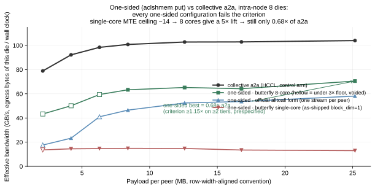

# 单边传输 vs 集合 a2a:预注册判负 + 两个上游库补丁

**一句话:在带宽扁平超节点的 8 die 节点内,用 CANN aclshmem 的 kernel 内单边写
(经 hyper-parallel 的 put 路径)做 MoE dispatch 形态的交换,两种实现(蝶形/官方
alltoall 形态)× 两种核数共 4 个配置,最好只到集合 a2a 的 0.68×,预注册判据(≥2 个有效档 ≥1.15×)零档
达标 —— 单边这条路在这台机器上关闭。** 过程中修出的两个上游库缺陷
(每调用 malloc/free:free 隐含设备同步把并发 put 串行化,且 kernel 的 SyncAll
在用已 free 的内存 —— UAF;block_dim 写死 1 无 setter)与一个使用陷阱
(完成计数用 EQ 在重复测量下必死锁)以可复用补丁/教训的形式随本仓发布
(`tools/onesided/`),对任何 Ascend + shmem 用户都适用。



## 1. 结果矩阵

| 实现 × block_dim | 有效档(≥3× 量具地板) | 单边带宽 | vs a2a(~104 GB/s) |
|---|---|---|---|
| 蝶形(单流串行)× 1 | 6/7 | 13–15 GB/s 平顶 | 0.13–0.16× |
| 蝶形 × 8 | 4/7 | 63–70 | **0.68×**(最好) |
| 官方 alltoall 形态(每对端一流)× 1 | 5/7 | 23–58,随尺寸爬升 | 0.25–0.56× |
| 官方形态 × 8 | 0(全档不足地板,且大尺寸撞设备超时) | — | 仪器极限,不算测量 |

(出处注:蝶形 ×8 行来自官方臂加入前的两臂版量具——蝶形口径两版相同;官方 ×8
在三臂版中撞设备超时,无有效读数。归档 JSON 的 verdict 字符串为当时版本的措辞。)

判据(跑之前写死):任一合法单边实现在 ≥2 个有效档上 ≥1.15× a2a → 值得往下做;
否则关闭。1.15 的出处:a2a 实测已达单 die 聚合出口物理值(122.4 GB/s,docs/05)
的 ~85%,1.15× 等价于"从 85% 打到 100% 线速"。

**为什么可以下结论(物理注脚)**:

- 蝶形调度 7 轮串行,每 die 的 7 条腿里 6 条走节点内链路(112.1 GB/s)、1 条走
  封装内直连(185),完美利用的上限 = 7/(6/112.1 + 1/185) ≈ 118.8 GB/s ≈ **1.14× a2a**
  —— 名义上 <1.15,但只差 0.8 个百分点,在输入量的测量噪声之内;**该形态的真正
  判死理由是实测**:8 核已把单 put 提到 70 GB/s,距自身上限还差 40%,缺口全在
  kernel 的 UB 中转实现,与官方臂同一瓶颈;
- 官方多链路形态的抽象上限 ≈ 122.4/104 ≈ 1.18×,物理上不排除,但现有 kernel 是
  GM→UB→远端 GM 的 MTE 中转(每字节过两次 UB),实测顶到 0.56×。要够 1.15
  需要一条 DMA 直达的新传输 —— 那是重写通信库,不是使用它。

## 2. 两个上游缺陷、一个使用陷阱(这部分对所有人有用)

`tools/onesided/build_shmem.sh` 会在编译 hyper-parallel 的 symmetric memory
时自动打补丁(幂等,带标记检查),每条都来自真实翻车:

1. **上游缺陷:每次 put 一组 `aclrtMalloc + aclrtMemset + aclrtFree`(32 B sync 区)**。
   `aclrtFree` 通常隐含设备同步 —— 单这一条就把整组带宽读数作废(所有 put 被
   串行化,等于从没有两个 put 真正在飞);且 kernel 里 `SyncAll` 用的正是这块
   **已被 free** 的内存(UAF,靠上述串行化侥幸不炸)。补丁:sync 区静态复用 +
   清零改 `aclrtMemsetAsync` **同流入队**。诚实注脚:同流入队不是装饰 —— 我们
   第一版补丁只做了静态复用、保留 host 同步 memset,结果 memset 不排流序,打在
   飞行中 kernel 的 flag 上造成永久自旋(实测卡死 3/8 张卡)。原版靠"每次都是
   新缓冲"天然免疫这个竞态;复用缓冲后,流序清零是正确性要件,不是优化。
   `put_mem_signal` 版本因被官方 alltoall 以多流并发调用,用 64 槽轮转池。
2. **`DEFAULT_BLOCK_DIM = 1` 写死且无 setter**。kernel 本身按多核写好了
   (`size_per_core = size_ / aiv_num_`),但上游只给 1 个 block —— 单核 MTE
   是带宽天花板(实测 13–15 GB/s 平顶,放开 8 核立刻 5×)。补丁:环境变量
   `TERRACE_SHMEM_BLOCK_DIM` 可调,**默认仍是 1、行为逐字不变** ——
   能力一旦可用就自动启用,等于把"能编译"当"行为正确"的证据(docs/04 同款教训)。
3. **使用陷阱(非上游 bug):完成计数用精确等于(EQ)在重复交换下必死**。
   `signal_wait_until` 的比较枚举只有 EQ/GT/LT。官方 alltoall 的一次性用法
   (新 signal、单次交换、用完即弃)下 EQ 是安全的 —— 计数单调升到目标就停。
   但基准/训练这类**重复交换**场景里,快的 rank 先进下一轮、把 +1 打进你的
   signal,"恰好等于 8k"的窗口被冲过头 → 永久自旋(实测全 rank 设备同步超时)。
   解法:**GT + (目标−1)**,单调递增计数下免疫冲过头。同族教训:任何
   「等计数 == N」的分布式判据都改 ≥。

## 3. 量具纪律(为什么这些数字可信)

- **launch 地板闸**:每尺寸档先测同样调用次数、载荷 1 元素的地板;耗时不足
  地板 3× 的档**读数作废**(图中空心点)。带宽读数的分辨率必须优于被测效应。
- **对齐口径**:所有载荷是真实行宽(H×dtype = 4096 B)的整数倍 —— 不对齐会
  掉进按 2 的幂阶梯变化的实现行为,测的是对齐效应不是传输方式。
- **对照臂同床**:a2a 与单边在同一进程、同一批缓冲、同一计时器下交替测量。
- **判据先于数据**:1.15× / ≥2 档 / 地板 3× 全部在首跑之前写死。

## 4. 复现

```
# 1) 编译(需要 hyper-parallel 源码;离线集群预放 3rdparty/shmem @ v1.3.0)
bash tools/onesided/build_shmem.sh /path/to/hyper-parallel-master
# 2) 跑(单节点 8 die;两种核数各一发)
TERRACE_SHMEM_BLOCK_DIM=1 torchrun --nnodes=1 --nproc_per_node=8 \
    tools/onesided/bench_onesided.py --out onesided_bd1.json
TERRACE_SHMEM_BLOCK_DIM=8 torchrun --nnodes=1 --nproc_per_node=8 \
    tools/onesided/bench_onesided.py --out onesided_bd8.json
```

判据、地板闸与判决全部内置在 bench 里,输出即结论。换机器请先重标 docs/05
的口径(a2a 的物理占比变了,1.15 这个阈值的含义也会变——阈值跟着你的机器
重新推导,别照抄)。
